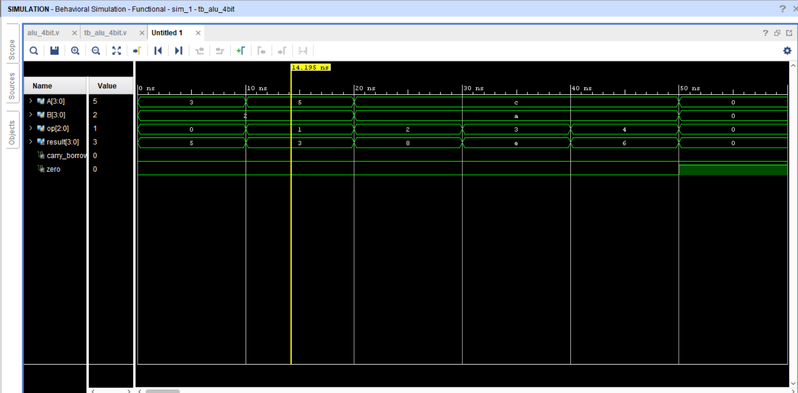

# 4-bit ALU Design using Verilog HDL

## Overview

Designed and verified a 4-bit Arithmetic Logic Unit (ALU) using Verilog HDL and Xilinx Vivado.

## Operations

- ADD
- SUB
- AND
- OR
- XOR

## Features

- 4-bit inputs
- 3-bit operation select
- Carry/Borrow flag
- Zero flag
- Combinational RTL design
- Verilog testbench
- Vivado behavioral simulation

## Tools

- Verilog HDL
- Xilinx Vivado

## Verification

All supported operations were verified using a Verilog testbench and Vivado behavioral simulation.

## Simulation Waveform

